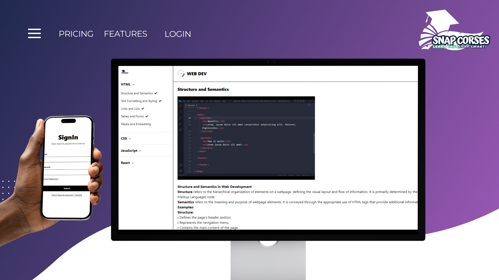

# 🌟 Snap Courses

 

## 🎉 Overview
 

Snap Courses is an innovative web application that leverages AI technology to generate customized online courses. Our platform empowers users to easily create engaging and structured courses tailored to their unique learning needs.

## 🎨 Features
- **Topic Input**: Seamlessly enter your main topics and subtopics using an intuitive interface.
- **Course Format Selection**: Choose between Theory + Images (free) or Theory + Videos (premium) for a personalized learning experience.
- **AI-Powered Generation**: Utilize advanced AI algorithms to create comprehensive and relevant courses based on user input.
- **Adaptable Learning Styles**: Cater to diverse learning preferences with a mix of visual, auditory, and textual resources.
- **Personalized Curriculum**: Receive a uniquely crafted curriculum aligned with your learning goals.
- **Real-time Preview**: Enjoy a live preview of your generated course before final approval.

## 🚀 How It Works
1. **Input Your Topics**: Begin your course creation by entering your chosen topics and relevant subtopics.
2. **Select Your Preferences**: Choose between Theory + Images or Theory + Videos to customize your learning journey.
3. **AI Course Generation**: Witness how our AI transforms your inputs into a tailored course.

## 💡 Benefits
- **Time Efficiency**: Save hours of manual planning with instant course generation.
- **AI-Enhanced Materials**: Ensure high-quality content through AI-driven recommendations.
- **Interactive Learning**: Engage users with various media formats to enhance understanding.

## 🌐 Get Started
Experience Snap Courses today! Follow these steps to get started:
1. Visit our live demo: [Snap Courses Demo](https://snap-courses.mohamed-k.dev)
2. **Login Credentials**:
   - **Email**: `mohamed.hassan-std@ai.iatseg.org`
   - **Password**: `Demo12`
3. Feel free to create your own account by signing up on our platform!

## 🎉 Overview
Snap Courses is an innovative web application that leverages AI technology to generate customized online courses. Our platform empowers users to easily create engaging and structured courses tailored to their unique learning needs.

## 🎨 Features
- **Topic Input**: Seamlessly enter your main topics and subtopics using an intuitive interface.
- **Course Format Selection**: Choose between Theory + Images (free) or Theory + Videos (premium) for a personalized learning experience.
- **AI-Powered Generation**: Utilize advanced AI algorithms to create comprehensive and relevant courses based on user input.
- **Adaptable Learning Styles**: Cater to diverse learning preferences with a mix of visual, auditory, and textual resources.
- **Personalized Curriculum**: Receive a uniquely crafted curriculum aligned with your learning goals.
- **Real-time Preview**: Enjoy a live preview of your generated course before final approval.

## 🚀 How It Works
1. **Input Your Topics**: Begin your course creation by entering your chosen topics and relevant subtopics.
2. **Select Your Preferences**: Choose between Theory + Images or Theory + Videos to customize your learning journey.
3. **AI Course Generation**: Witness how our AI transforms your inputs into a tailored course.

## 💡 Benefits
- **Time Efficiency**: Save hours of manual planning with instant course generation.
- **AI-Enhanced Materials**: Ensure high-quality content through AI-driven recommendations.
- **Interactive Learning**: Engage users with various media formats to enhance understanding.

## 🌐 Get Started
Experience Snap Courses today! Follow these steps to get started:
1. Visit our live demo: [Snap Courses Demo](https://snap-courses.mohamed-k.dev)
2. **Login Credentials**:
   - **Email**: `mohamed.hassad@gmail.com`
   - **Password**: `Demo12`
3. Feel free to create your own account by signing up on our platform!

### 🛠️ Built With

This section lists the major frameworks and libraries used to bootstrap the Snap Courses project. 

* [![Node.js][Node.js]][Node-url]
* [![React][React.js]][React-url]
* [![MongoDB][MongoDB]][MongoDB-url]
* [![Gemini API][Gemini]][Gemini-url]
* [![Unsplash][Unsplash]][Unsplash-url]
* [![Render.com][Render.com]][Render-url]
* [![Firebase][Firebase]][Firebase-url]
* [![React Router][ReactRouter]][ReactRouter-url]
* [![Redux][Redux]][Redux-url]
* [![Jest][Jest]][Jest-url]
* [![Git][Git]][Git-url]

<!-- Links for the badges -->
[Node.js]: https://img.shields.io/badge/Node.js-339933?style=flat&logo=node.js&logoColor=white
[Node-url]: https://nodejs.org/
[React.js]: https://img.shields.io/badge/React-61DAFB?style=flat&logo=react&logoColor=black
[React-url]: https://reactjs.org/
[MongoDB]: https://img.shields.io/badge/MongoDB-47A248?style=flat&logo=mongodb&logoColor=white
[MongoDB-url]: https://www.mongodb.com/
[Gemini]: https://img.shields.io/badge/Gemini_API-FF4F00?style=flat&logo=google&logoColor=white
[Gemini-url]: https://cloud.google.com/gemini
[Unsplash]: https://img.shields.io/badge/Unsplash-00A5E0?style=flat&logo=unsplash&logoColor=white
[Unsplash-url]: https://unsplash.com/
[Render.com]: https://img.shields.io/badge/Render.com-6A2C92?style=flat&logo=render&logoColor=white
[Render-url]: https://render.com/
[Firebase]: https://img.shields.io/badge/Firebase-FFCA28?style=flat&logo=firebase&logoColor=black
[Firebase-url]: https://firebase.google.com/
[ReactRouter]: https://img.shields.io/badge/React_Router-CA4245?style=flat&logo=react-router&logoColor=white
[ReactRouter-url]: https://reactrouter.com/
[Redux]: https://img.shields.io/badge/Redux-764ABC?style=flat&logo=redux&logoColor=white
[Redux-url]: https://redux.js.org/
[Jest]: https://img.shields.io/badge/Jest-32B3C3?style=flat&logo=jest&logoColor=white
[Jest-url]: https://jestjs.io/
[Git]: https://img.shields.io/badge/Git-F05032?style=flat&logo=git&logoColor=white
[Git-url]: https://git-scm.com/
